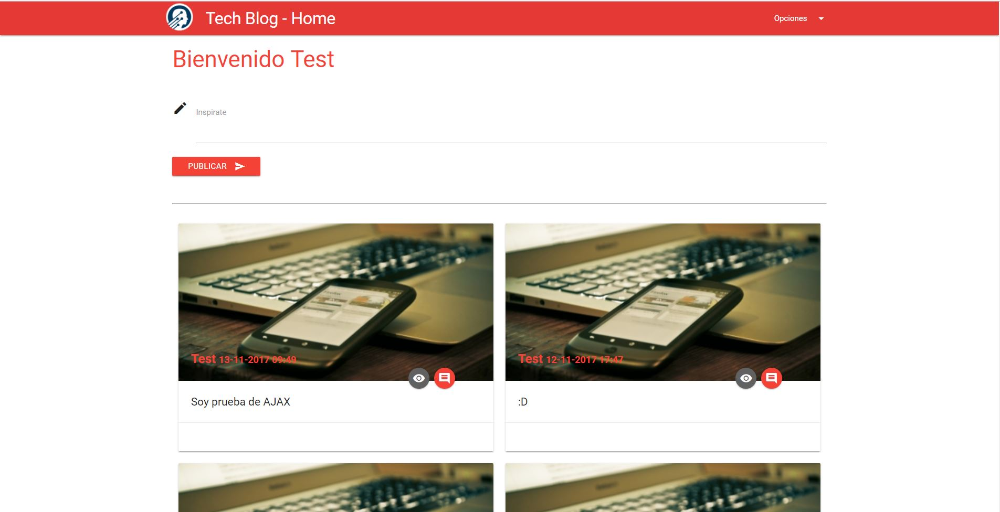
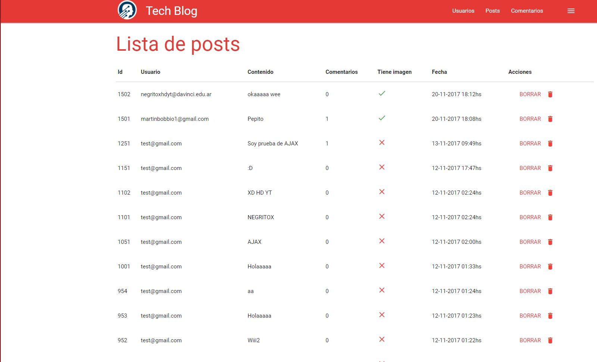
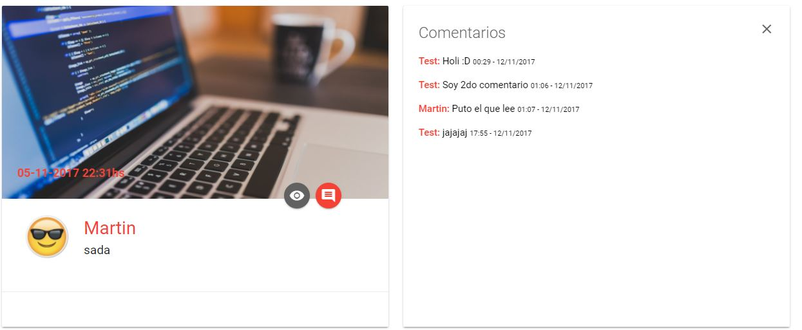

## Tech Blog

**Descripcion:**
Trabajo práctico del sexto cuatrimestre de la Escuela DaVinci desarrollado con *Maven*, *JSF* y un maquetado con *Materialize*.
La pagina ofrece un sistema de *login*, *registro* y la posibilidad que los usuarios suban posts y puedan ver los que subieron.
Todo esto se realiza mediante conexiones a una Base de datos *SQL* y con el modelo de la misma generada por *Entities*.

**Tecnologias usadas:**
Maven, Materialize y Java

Inicio:

Lista de Usuarios:

Comentarios:

